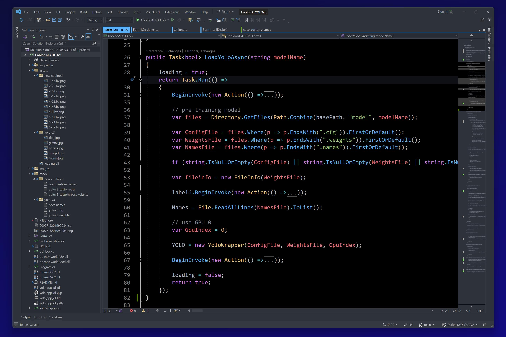
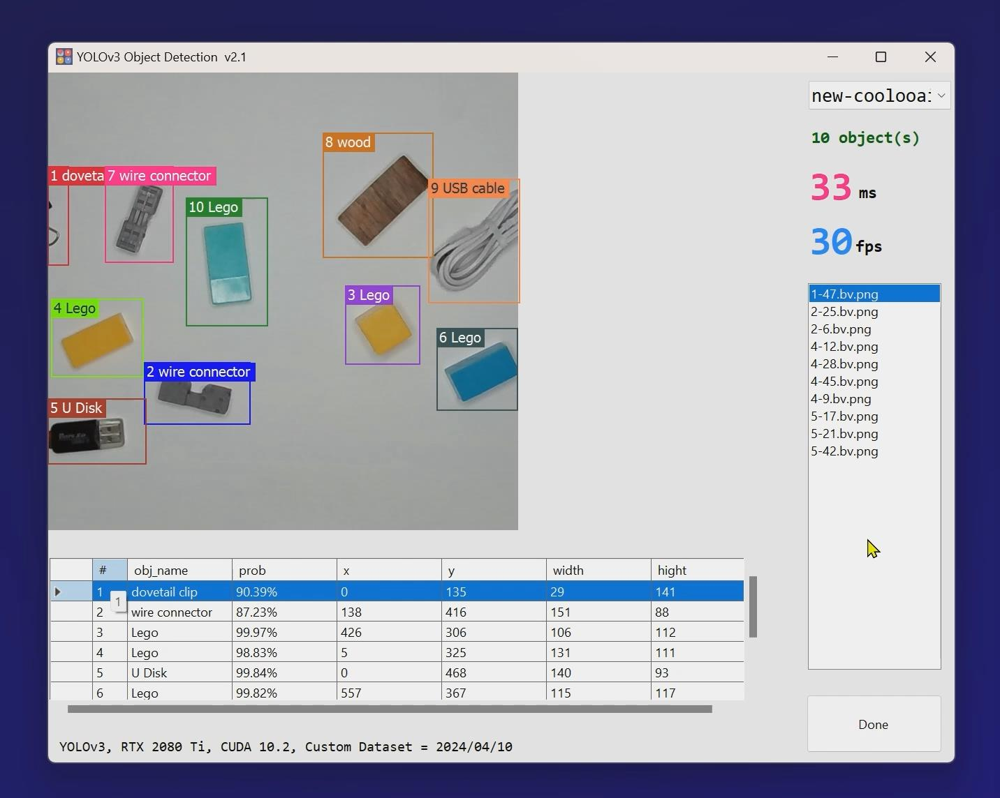

# Upgrade to the version 2 for [Darknet.YOLOv3](https://github.com/12343954/Darknet.YoloV3)

[Features]
- Fixed `Detect(byte[] imageData)` method of `yolo_cpp_dll.dll`, the performance is close to the `Detect(string filename)`
- Remove third-party of `Alturos.Yolo.3.0.6-alpha.dll` dependencies
- Use the latest training dataset (2024-4-10)

 

 

<video width="800" height="600" controls>
    <source src="./images/demo.mp4" type="video/mp4">
</video>

## MIT LICENSE