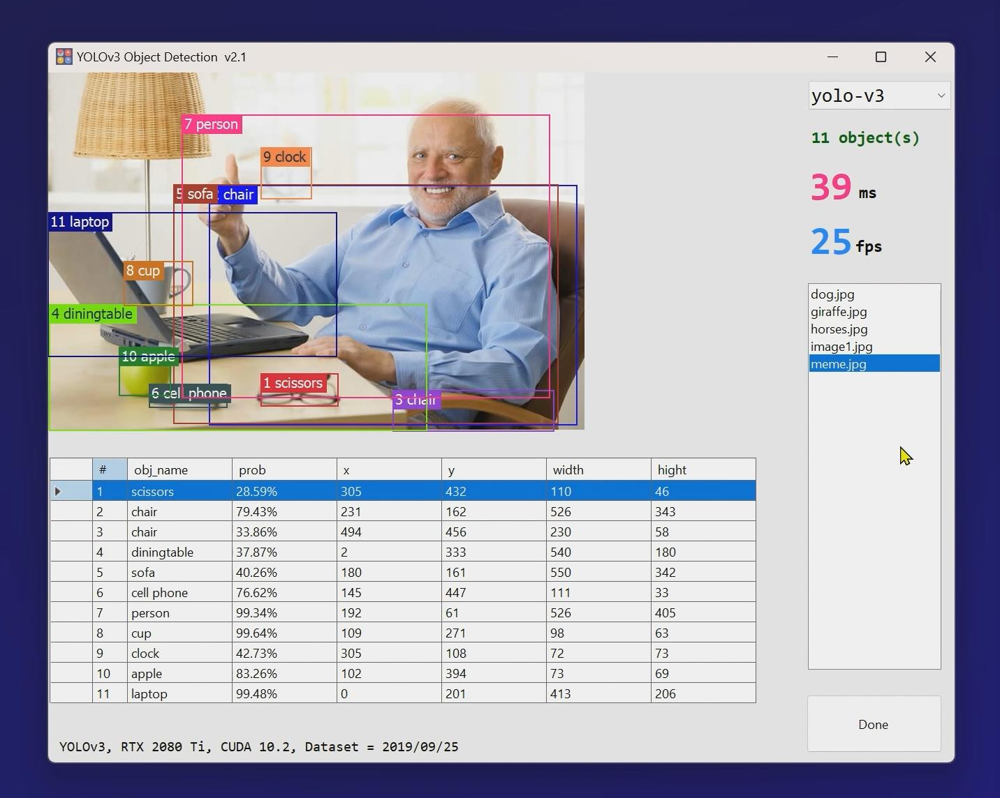

# Code in (4 steps) YOLOv3 in C#, Custom dataset, 30+ fps, faster & stable than python | 2020 AI Tech

### This repository is an upgraded version of the previous  [Darknet.YOLOv3](https://github.com/12343954/Darknet.YoloV3)
 
 

# 1. Features
1. Fixed `Detect(byte[] imageData)` method of `yolo_cpp_dll.dll`, the performance is close to the `Detect(string filename)`
2. Remove third-party of `Alturos.Yolo.3.0.6-alpha.dll` dependencies
3. Use the latest training dataset (2024-4-10)
 
 
# 2. Usage
1. Unzip the zip files to their folders
    - `./opencv_world420d.zip`
    - `./model/yolo-v3/yolov3.weights.zip`
    - `./model/new-coolooai/yolov3_custom_best.weights.zip`
2. F5 to run the code
 
 
# 3. Precautions
1.  After a lot of testing and switching between many driver and cuda versions, found that `CUDA10.2+YOLOv3` are the fastest. Other versions are inefficient and have a serious performance loss.  

    | NVIDIA      | GeForce RTX 2080 Ti GeForce RTX 2060| |
    | ----------- | ----------- | ----------- |
    | Driver      | 456.71 | <i style='color:red'>!important</i> |
    | Driver Date      | 2020/9/30      |  |
    | Driver Version   | 27.21.14.5671  |  |
    | CUDA   | 10.2        | cuda_10.2.89_441.22_win10.exe |
    | NVCC   | 10.2        | <i style='color:red'>!important</i> |
    | cuDNN  | 10.2        | <i style='color:red'>!important</i> |
    | YOLO   | V3 (code for 2019) | <i style='color:red'>!important</i> |

2. Make sure that the graphics driver is not automatically updated to the latest version.  
This guarantees the best performance of YOLOv3.
3. If you get the "yolo_cpp.dll.dll not found" error, you need to recompile the `yolo_v3.dll` with VS2019, not the VS2022.   
4. Watch this: [Install & test YoloV3 on Windows 10](https://www.youtube.com/watch?v=zT8eDXpslXw)

 

# 4. Demo

https://github.com/12343954/Darknet.YOLOv3.V2/assets/1804003/2973416a-1465-42e9-b892-4d9010b910ea

<video width="800" height="600" controls>
    <source src="./images/demo.mp4" type="video/mp4">
</video>

# 5. MIT LICENSE
Enjoy it!
